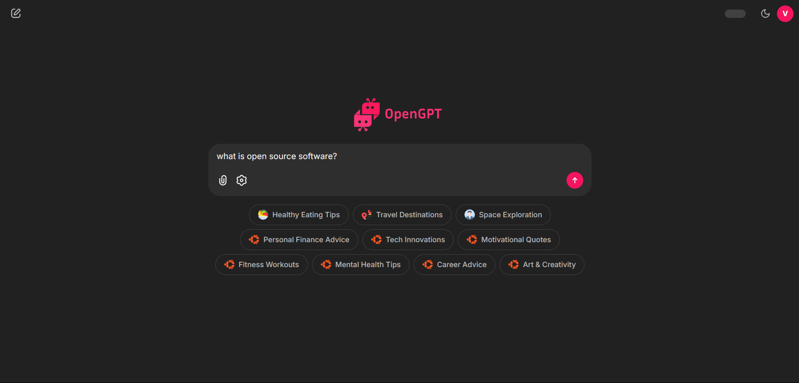

<h1 align="center">🤖 OpenGPT Framwork </h1>

<p align="center">
   <b>An open-source, privacy-first GPT chatbot framework with real-time web scraping & local deployment ⚡️</b>
</p>

<p align="center">
  <a href="https://www.linkedin.com/in/vaibhavkokare/" rel="nofollow">
    
  </a>
  <a href="https://github.com/Vikokare" rel="nofollow">
    
  </a>
<p>

<p align="center">
  <a href="readme-assets/chatbot-head-ui.png">
    
  </a>
</p>


## Table of Contents

- [Problem Statement](#problem-statement)
- [Features](#features)
- [Technologies Used](#technologies-used)
- [Installation](#installation)
- [Usage](#usage)
- [Project Structure](#project-structure)
- [Contributing](#contributing)
- [License](#license)

## Problem Statement

As reliance on AI chatbots grows, many existing platforms require cloud access and compromise user privacy. Moreover, they often lack up-to-date data. **OpenGPT** addresses these issues by offering:

- A fully local GPT-based chatbot framwork
- Real-time, customizable web scraping  
- Privacy-preserving architecture  

## Features

- **Real-Time Web Scraping**: Fetches the latest data from specified websites to ensure up-to-date responses.
- **Local LLM**: Connects with GPT model locally for enhanced privacy.
- **User Authentication**: Supports Google OAuth for secure user login.
- **Query History**: Maintains a history of user queries for easy access.
- **Feedback Mechanism**: Enables users to provide feedback on chatbot responses to improve accuracy.

## Technologies Used

- **Langchain**: Framework for building applications with language models.
- **Chainlit**: Tool for creating interactive web applications for the chatbot.
- **GroqAPI**: Manages data queries efficiently.
- **Playwright**: Framework for web scraping.

## Installation

### Prerequisites

Before installing, ensure you have:

- Python 3.8 or higher
- pip

### Step-by-Step Installation

1. **Clone the Repository**
   ```bash
   git clone https://github.com/yourusername/OpenGPT.git
   cd OpenGPT
   ```

2. **Install Required Packages**
   ```bash
   pip install -r requirements.txt
   ```

3. **Run Chainlit App**
   ```bash
   chainlit run app.py
   ```

4. **Access the App**
   Open your web browser and navigate to `http://localhost:3000` to access the OpenGPT chatbot.

## Usage

1. **Login**: Use Google OAuth to log into the application.
2. **Query the Chatbot**: Type your questions into the input box and press Enter.
3. **View Query History**: Access your past queries for quick reference.
4. **Provide Feedback**: Rate the chatbot's responses to help improve its accuracy.

## Project Structure

```
OpenGPT/
├── app.py                # Main Chainlit application file
├── requirements.txt      # List of required Python packages
├── scraper/              # Directory for web scraping modules
│   ├── __init__.py
│   └── scraper.py
├── models/               # Directory for language models
│   ├── __init__.py
│   └── gpt_model.py
└── static/               # Static files (CSS, images, etc.)
```

## Contributing

We welcome contributions to enhance OpenGPT! Please follow these steps:

1. Fork the repository.
2. Create a new branch for your feature or bug fix.
3. Commit your changes.
4. Push to the branch.
5. Open a pull request with a description of your changes.

## License

This project is licensed under the MIT License - see the [LICENSE](LICENSE) file for details.